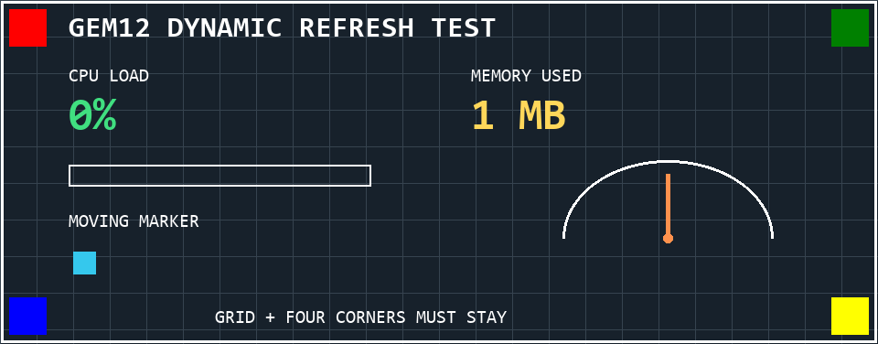
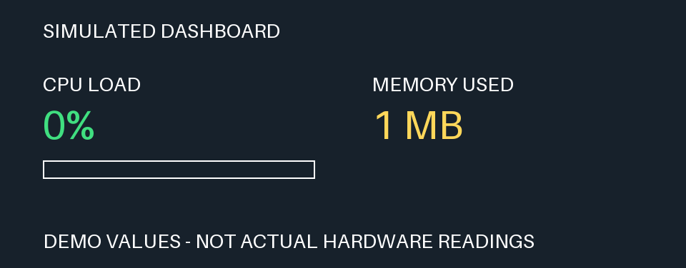

# GEM12 动态仪表刷新验证记录

日期：2026-10-09。

## 结论和适用范围

当前这块内置 GEM12 屏幕已完成 600 帧连续仪表刷新测试，以及 1 帧结束检查画面，总计约 308.5 秒。未发生串口传输错误或本地数据重建不一致。用户分别确认运行中的仪表持续更新、无显示异常，以及结束画面没有旧数字或运动轨迹残留。

该轮使用模拟仪表数据和独立的临时候选发送器，当时未修改正式 `Screen.show()`。后续已将已验证的差分逻辑加入正式接口，当前用法见项目 README。这里的 600 帧数据仍对应候选实现，不能作为正式接口的 600 帧运行记录。结论针对当前设备、该测试画面和每秒 2 次的目标节奏；不代表所有仪表布局、更高刷新率或数小时运行均已验证。

普通差分帧大多能在 0.5 秒内完成，但出现过 1 次 1.157 秒的延迟；不能据此承诺严格实时的 2 Hz。强制整帧刷新也会占用约 1.7～1.8 秒。

## 设备和测试方法

- USB VID/PID：`0416:90A1`；串口：COM3；波特率：1,500,000。
- 分辨率：960×376；小端 RGB565；47 字节图像数据块。
- 使用已验证的 `0x05 → 0x08 → 0x06` 流程，只发送新旧 RGB565 数据中变化的块，保留原始完整画面的字节偏移。
- 每轮从完整背景重新绘制画面，避免长文字缩短、进度回落和图形移动时旧内容保留在目标图片中。
- 每帧只在末尾调用一次 `flush()`。发送后读取当时可用的串口响应，避免接收缓冲持续积累；未根据 `41` 数量推断每块或每帧的 ACK 规则。
- 本地维护一份字节缓冲，应用实际构造的数据包，并与目标 RGB565 数据逐字节比较。这验证的是发送数据的重建正确性，不是屏幕像素回读。
- 每轮处理完成后补足到 0.5 秒；超过 0.5 秒时不补睡眠。较慢的帧会使总测试时间超过 300 秒。

### 动态内容

1. CPU 数值在 `100%、9%、0%、67%、1%、45%` 之间切换，覆盖长文字变短和进度条回落至空。
2. 内存数值在 `16384、1、8192、9、32768、512 MB` 之间切换。
3. 橙色指针在半圆仪表内反复移动；蓝色方块沿水平方向移动并返回起点。
4. 网格、标题、白色边框和四角色块保持不变，供目视检查非更新区域。
5. 插入 24 个重复画面帧，均发送 0 个图像数据块。
6. 在 0 起算帧号 120、240、360、480 处强制整帧发送。
7. 在帧号 300 前关闭并重新打开软件串口，新的候选发送器无缓存，其首帧发送完整 15,360 块。此过程不涉及硬件拔插。

## 传输和耗时结果

600 个周期帧分为：570 个普通差分帧、24 个无变化帧、6 个整帧（初始帧、4 个强制整帧、1 个重新连接后的首帧）。末尾检查画面另通过 724 个差分块发送，未用整帧覆盖旧内容。

| 普通差分帧指标 | 中位数 | 95 百分位 | 最大值 |
|---|---:|---:|---:|
| 图像数据块数 | 722 | 819 | 856 |
| 差分发送耗时 | 0.0857 秒 | 0.1048 秒 | 0.2955 秒 |
| 单帧总处理耗时 | 0.1837 秒 | 0.2806 秒 | 1.1566 秒 |

单帧总处理耗时包含绘图、完整 RGB565 编码、差分发送、本地数据重建核对及读取当时可用的响应，不包含补足刷新周期的等待。差分发送计时包含本地数据重建核对，不能解读为屏幕呈现延迟。

- 570 个普通差分帧中，569 个在 0.5 秒内完成，1 个超出。
- 最慢的是帧号 349：绘图 0.000934 秒、编码 0.860015 秒、差分发送及核对 0.295541 秒，总处理 1.156573 秒。记录只能确认耗时分布，不能确认当时系统调度或负载的具体原因。
- 最早 60 个普通差分帧总处理耗时中位数为 0.1710 秒，最后 60 个为 0.1748 秒；本轮未观察到首尾中位数明显增长，但中间存在耗时波动。
- 6 个整帧均发送 15,360 块，总处理耗时约 1.667～1.801 秒。
- 软件串口重开后的帧号 300：15,360 块、发送约 1.579 秒、总处理约 1.667 秒。
- 600 个周期帧的协议发送量合计 28,801,090 字节，不含开屏命令及末尾检查帧。
- 记录到的串口响应为累计 482,880 字节，最大一次待接收量为 15,185 字节。响应样本见逐帧记录，未以响应数目作为显示正确性的依据。

逐帧数据与汇总：[动态刷新验证数据.json](动态刷新验证数据.json)。

## 目视确认

运行期间，用户确认 CPU／内存数值、进度条、指针和方块持续更新，没有闪黑、花屏或明显残影。

结束时，通过差分更新留下以下画面：CPU `0%`、内存 `1 MB`、空进度条、单根竖直橙色指针、左侧单个蓝色方块。用户确认与预期图完全一致，没有旧数字、旧指针、移动轨迹残留或其他异常，网格及四角色块完整。

该图片是本地生成的预期图，不是屏幕实拍。目视确认对应运行中和结束时的观察，不意味着逐帧对真实屏幕做了像素校验。

## 离线检查和后续约束

4 项新增临时检查通过：42 帧文字／进度／运动图形的逐包重建；模拟写入中断后缓存失效及下一帧整帧恢复；模拟 flush 失败不提交缓存；新的软件连接首帧整帧发送。项目原有 5 项单元测试亦全部通过。

硬件拔插按用户要求不安排、不作为验收条件；发送异常恢复继续用模拟测试覆盖。

正式封装时，应保留首帧整帧、发送异常后的缓存失效、强制整帧恢复和帧末 flush，并明确处理持续返回的串口数据。本轮始终编码完整图像，实际统计已显示编码耗时是后续需要关注的部分。

该轮未增加真实硬件数据采集、正式面板配置或公开差分 API。临时脚本和中间文件已在保存验证记录、逐帧数据及预期图后清理。该轮结束时串口连接已关闭，屏幕保留结束检查画面。

## 正式接口实现及短时验证

2026-10-09 已将候选逻辑加入正式 `Screen.show(source, force_full=False)`：

- 首次整帧，后续按 RGB565 数据块做差分；相同图片返回 0 个数据块。
- `force_full=True` 显式整帧刷新，并更新当前缓存。
- 每个连接独立缓存，关闭连接及开关屏命令使缓存失效。
- 开始发送前将缓存置为失效；发送、flush 或响应读取失败后，下一次发送整帧。仅图片读取失败时保留已有缓存。
- 每帧结束只调用一次 flush，读取当前可用响应，成功后提交缓存。

正式接口共 14 项单元测试通过，覆盖 RGB565、原始偏移及跨块像素重建、相同画面跳过、强制整帧、新连接首帧、控制命令缓存失效、短写入、写入／无进展／flush／读取失败后的整帧恢复，以及响应消费。

随后使用公共接口和 `examples/show_dashboard.py` 的模拟图片完成 28 帧真机短时验证：

- 帧号 0、14（软件串口重开后的首帧）均发送 15,360 块。
- 22 个普通差分帧发送 528～1,004 块，总处理耗时约 0.211～0.340 秒，包含图片绘制、编码及发送。
- 4 个重复帧均发送 0 个图像数据块。
- 末尾显式 `force_full=True` 返回 15,360，随后相同图片返回 0。
- 全部发送完成，用户确认最终 CPU 为 0%、内存为 1 MB、进度条为空，文字完整，没有残留、花屏或其他异常。

原始记录：[正式接口验证数据.json](正式接口验证数据.json)。预期画面如下，为本地生成图片：

这是正式接口的短时验证。前述 600 帧记录仍属于候选实现；正式接口在实际仪表布局下的数小时运行尚未进行。串口已关闭，屏幕保留模拟仪表的最后一帧。
