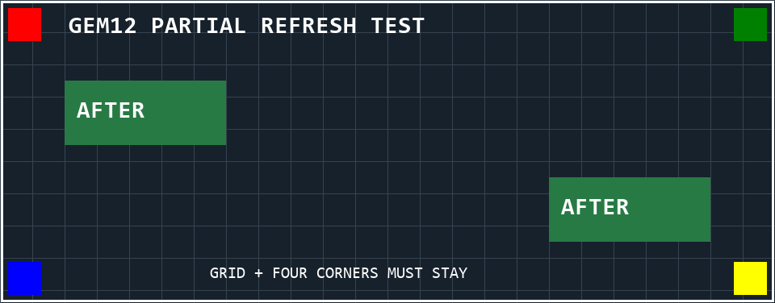

# GEM12 差分刷新验证记录

日期：2026-10-09。

## 结论与范围

当前这块 GEM12 屏幕支持在 `0x05 → 0x08 → 0x06` 流程中仅发送发生变化的 47 字节数据块。未发送的区域能够保留已有内容；无变化时只发送帧开始和结束命令，也能保持画面。

上述两项已在 COM3（USB VID/PID `0416:90A1`）发送测试数据，并分别得到用户目视确认。该轮验证时没有修改正式的 `Screen.show()`，当时默认行为为整帧发送；后续已将差分逻辑加入正式接口，当前用法见项目 README。

参考实现：aoostar-rs 主分支快照 [`2f4d959`](https://github.com/zehnm/aoostar-rs/blob/2f4d95957d2d61f9fe5cd27e4cf14bd2ae566f63/crates/asterctl-lcd/src/aoo_screen.rs)。本轮结果针对当前设备，不代表其他设备或固件的兼容性。

## 测试画面和步骤

先发送完整的 960×376 测试画面：深色网格、白色边框、标题、四角色块，以及两个红色 `BEFORE` 框。

随后将两个矩形区域更新为绿色 `AFTER` 框：

- 左上区域：`(80, 100)` 至 `(279, 179)`。
- 右下区域：`(680, 220)` 至 `(879, 299)`。

新旧完整图像分别编码为小端 RGB565，按 47 字节比较。仅发送变化的数据块，数据块偏移仍为原始完整画面中的字节位置，不重新编号。每次发送后只在帧末调用 `flush()`。

预期画面如下；这是本地生成的预期图片，不是屏幕实拍或回读截图：

用户确认：两个框均变为绿色并显示 `AFTER`；其余网格、白色边框、标题及四角色块完整，没有花屏或错位。

第二步只发送帧开始和结束命令，不发送任何图像数据块。用户确认：画面保持正常，没有闪黑、清空或花屏。

第三步强制发送当前测试画面的完整数据，串口写入完成；这一操作没有另行请求目视确认。

## 真机传输记录

| 操作 | 数据块数 | 协议字节数 | 发送耗时 | 证据 |
|---|---:|---:|---:|---|
| 初始整帧 | 15,360 | 906,264 | 1.5925 秒 | 串口写入及 flush 完成 |
| 两区域差分更新 | 1,518 | 89,586 | 0.1650 秒 | 串口发送完成，用户目视确认正确 |
| 无变化帧 | 0 | 24 | 0.0078 秒 | 串口发送完成，用户目视确认画面保持 |
| 强制整帧 | 15,360 | 906,264 | 1.6294 秒 | 串口写入及 flush 完成 |

协议字节数为 `16 + 块数 × 59 + 8`，不含开屏命令。发送耗时从发送帧开始命令前计时，到帧末 `flush()` 返回为止，不包含图片绘制、RGB565 编码、打开串口和等待设备响应的时间。

本次两区域更新相较初始整帧，协议数据量减少约 90.1%，发送耗时减少约 89.6%。这是单次测试数据，不能视为持续运行或动画帧率指标。

初始整帧及差分更新结束后读取到 16 个 `41`；无变化帧结束后读取到 `41 41`；强制整帧结束后读取到 16 个 `41`。读操作最多读取 16 字节，这些是当时读取到的串口响应，未将其解释为每帧或每块的独立 ACK；实际显示结果依据用户目视确认。

## 离线验证

临时候选实现的 6 项测试全部通过：

1. 首帧发送全部 15,360 块；跨块边界、非连续偏移及最后一字节的变化，应用差分后可精确重建目标数据。
2. 相同帧不发送图像数据块，仅发送帧开始和结束命令。
3. 模拟发送中途失败后清空缓存，下次发送完整帧。
4. 模拟 `flush()` 失败后不提交缓存。
5. 强制整帧选项能够绕过已有缓存。
6. RGB888 不同但编码后的 RGB565 相同，不产生无效差分数据块。

项目原有 5 项单元测试也全部通过。临时脚本、测试结果 JSON 和中间图片已在记录保存后清理。

## 尚未验证及后续实现约束

- 屏幕是机器内置硬件，按用户要求不安排硬件拔插测试，也不将其作为验收条件；发送异常后的恢复用模拟测试覆盖。软件串口关闭后重新打开的验证见[动态刷新验证记录](动态刷新验证记录.md)。
- 后续已完成每秒 2 次、600 帧的连续动态验证，见[动态刷新验证记录](动态刷新验证记录.md)；更高刷新率、数小时运行和其他固件版本尚未测试。
- 正式加入缓存时，应在首次连接、缓存失效或显式强制刷新时发送整帧；发送异常后应清空缓存，仅在完整发送及 flush 成功后提交新缓存。
- 差分应比较 RGB565 数据，并保留原始字节偏移；不改变已验证的命令、47 字节分块大小或字节序。
- 本轮候选算法仍然编码完整图像，仅减少发送的数据块数。
- 屏幕保留当前 `AFTER` 测试画面，串口连接已关闭。
